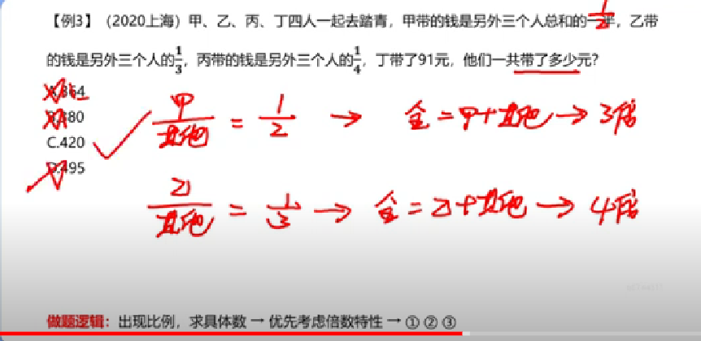
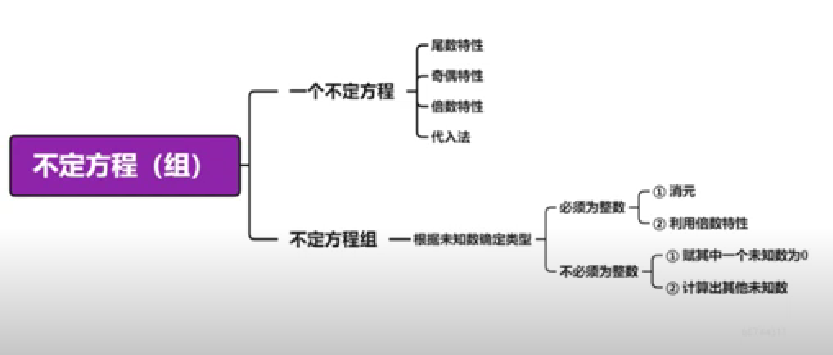
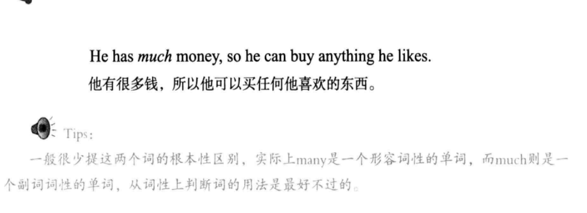
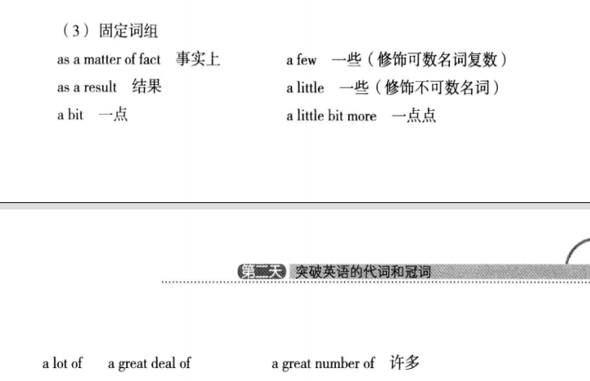
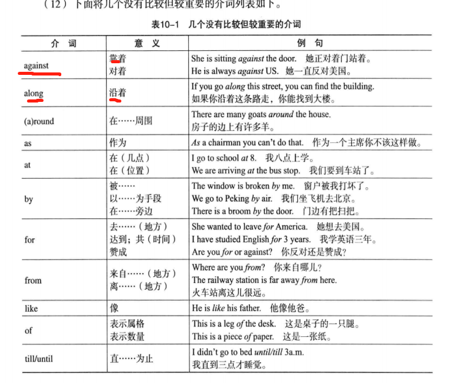
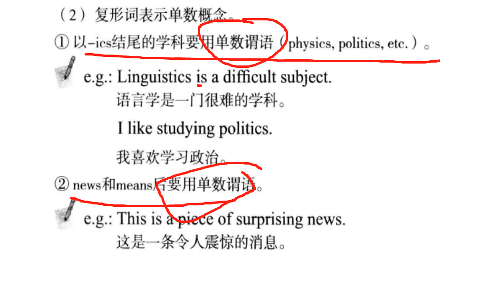

#### 3天复习中国农业大学二学位考试___Day1.
[返回主页](https://github.com/MINNINS/CAU_2022/blob/main/README.md)
###### 置顶
* [知识框架](#p1)
* [任务点目录](#mulu)
* [2021，2020年高考Ⅰ、Ⅱ卷英语语法题](#gaokao)
* [数量关系视频1笔记](#shuliang)
* ["第一天”~“第十二天”英语语法笔记](#yufa)
* [刷题APP推荐](#tuijian)

---

#### 知识框架

----
“语法词汇10道，完形填空一篇20道，阅读理解四篇20道  这样吧 50道题一道两分。” 

###  任务
Day 1.
- [x] 1.粉笔政治常识 30道题目（时政）
- [x] 2.数量关系 视频1(3个小时，开2倍速)
- [x] 3.英语《十二天搞定语法》第一天
- [x] 4.英语《十二天搞定语法》第二天
- [x] 5.英语《十二天搞定语法》第三天
- [x] 6. 2021年高考英语I卷语法填空题
- [x] 7. 2021年高考英语Ⅱ卷语法填空题
- [x] 8.英语《十二天搞定语法》第四天
- [x] 9.英语《十二天搞定语法》第五天
- [x] 10.英语《十二天搞定语法》第六天
- [x] 11.英语《十二天搞定语法》第七天
- [x] 12.英语《十二天搞定语法》第八天
- [x] 13.小程序“专升本英语1000题”刷40道英语语法题目
- [x] 14.英语《十二天搞定语法》第九天
- [x] 15.英语《十二天搞定语法》第十天
- [x] 16.英语《十二天搞定语法》第十一天
- [x] 17.英语《十二天搞定语法》第十二天
- [x] 18.2020年高考英语I卷语法填空题
- [x] 19.2020年高考英语Ⅱ卷语法填空题

----
<b>Day1.时政笔记</b> 
1. 新疆三峡工程：阿尔塔什水利枢纽工程
2. 体育强国的基础在于群众体育
3. 2020年要加快乡村产业振兴，按照“稳粮，优棉。。。”的思路
4. 普查采用全面调查的方法，以户为单位进行登记
5. 多门多网不属于深圳政务服务新模式
6. 发展是造福人民的发展
7. 党的十九届五中全会精神：坚持扩大内需这个战略基点，加快培育完整内需体系。
8. 不属于新发展阶段全面推进乡村振兴措施：保障农村贫困人口基本医疗和住房安全
9. 输血式扶贫 x   开放式扶贫 √

----
###  2021，2020年高考英语语法题[返回](#zhiding)

<b>2021年高考I卷语法填空题</b> 

<b>答案</b> 

----

<b>2021年高考英语Ⅱ卷语法填空题</b> 

<b>答案</b> 

---

<b>2020年高考英语Ⅰ卷语法填空题</b> 

<b>答案</b> 

---

<b>2020年高考英语Ⅱ卷语法填空题</b> 

---

###  数量关系笔记[返回](#zhiding)

---

###  "第一天”~“第十二天”英语语法笔记[返回](#zhiding)

----

###  刷题APP推荐[返回](#zhiding)

<b>记得回顾错题</b> 

* 英语语法：小程序“专升本英语1000题”
* 英语阅读：

英语语法：先从《十二天搞定英语语法》学习基本的理论，然后在小程序“专升本英语1000题”中练习题目。 
