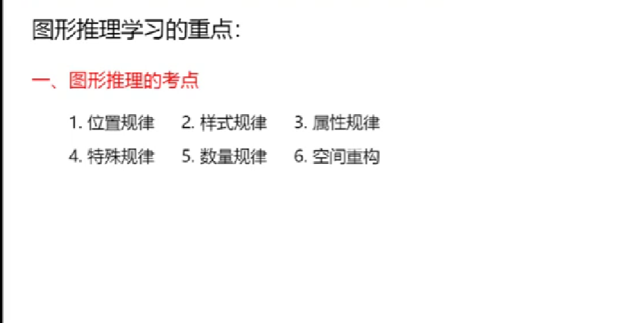
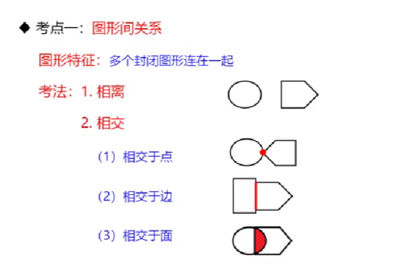
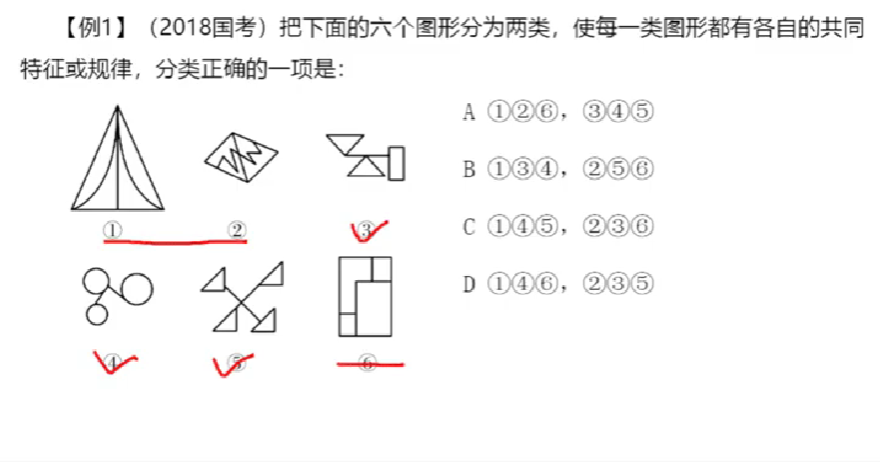
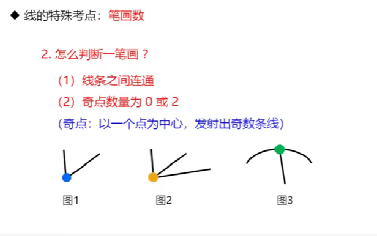
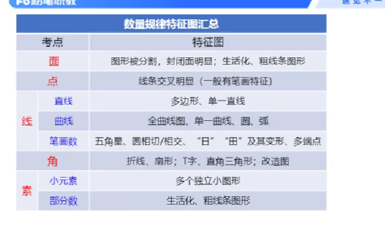

## Day_3笔记记录

### [返回主页](https://github.com/MINNINS/CAU_2022/blob/main/README.md)

* [任务点](#task)
* [图形推理笔记](#note)
  
置顶

----

2021年国考题型（当作一个参考）

-----

### 任务点[返回](#top)

- [x] 图形推理
  
----

### 图形推理笔记[返回](#top)

## [返回](#top)

## [返回](#top)

## [返回](#top)

## [返回](#top)

## [返回](#top)

## [返回](#top)

## [返回](#top)

## [返回](#top)

## [返回](#top)

## [返回](#top)

## [返回](#top)

## [返回](#top)

----
