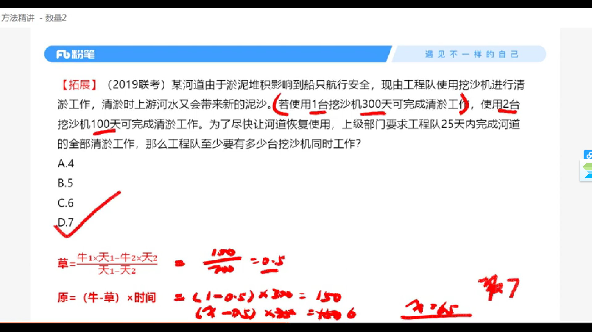

## Day_2 记录

<b>[返回主页](https://github.com/MINNINS/CAU_2022)</b> 
置顶
* [任务点](#task)
* [笔记](#note)

---

任务点 [返回](#top)

- [x] 1.数量关系 视频2
- [x] 2.数量关系 视频3
- [x] 3.数量关系 视频4

---

数量关系视频2-4笔记 [返回](#top)

### [返回](#top)

### [返回](#top)

### [返回](#top)
