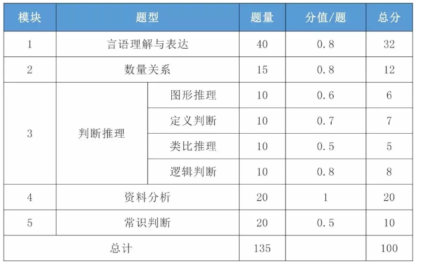
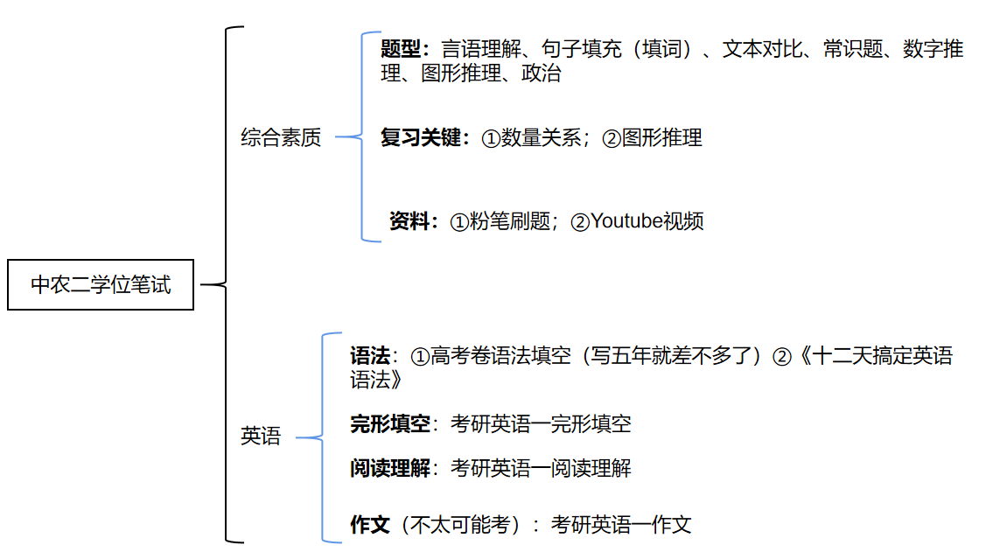

## 考前刷题

##### 置顶 

* [任务点](#task)
* [复习指南](#tip)
* [做题轨迹跟踪](#number)
* [数学运算的分类](#p1)
* [刷题笔记](#note2)
* [估分](#gufen)

- [x] 复习Day_02综合素质笔记
- [x] 复习Day_03综合素质笔记
- [x] 复习第一天——第十二天 英语语法
- [x] 做一套专四的英语语法题目——英语专业四级（2021年题目）
- [x] "专升本英语1000题”刷20道题目
- [x] "专升本英语1000题”刷20道题目
- [x] "专升本英语1000题”刷20道题目
- [x] 2022年英语一4篇阅读
- [x] 2018年4篇阅读
- [x] 2009年完形填空
- [x] 2010年完形填空
- [x] 复习英语前几天的生词笔记
- [x] 2022年英语一完形填空
   
  
  <b>考英语的时候冷静一点点,按着自己的节奏来，先把阅读理解写了，然后再写其他的，阅读理解的分数是大头，尽量拿高分，细心点。明天考完行测后复习一下英语语法，很快的，就图个安心而已</b>

----

<b>每复习一个小节，要研究透对应的视频练习题，然后在粉笔app上做30道题目，特别是图形推理和数学运算，虽然内容有点多，但是后天要考试了，加油吧....,2022.6.16</b>

---

#### 复习指南[  返回 >](#top)

----

#### 做题轨迹跟踪[  返回 >](#top)

<b>2022年</b> 

|  题目类型  | 细分 | 数量 | 正确率|完成时间 |
| ----- | --- | --- |--|----|
| 常识判断| | 15 | | 6.16, 22:22 |
| 常识判断|| 15| |6.16,22:33|
|言语理解与表达|逻辑填空|15|13/15|6.16,23:00 |
|言语理解与表达|逻辑填空|15|10/15 |6.16,23:09|
|言语理解与表达|阅读理解| | |
|言语理解与表达|阅读理解| | |
|言语理解与表达|语句表达：<b>语句排序题</b>| | |
|言语理解与表达|语句表达：<b>语句排序题</b>| | |
|言语理解与表达|语句表达：<b>语句填空题</b>|15|10/15|6.16,23:33|
|言语理解与表达|语句表达：<b>语句填空题</b>| | |
|言语理解与表达|语句表达：<b>接语选择题</b>|15|7/15|6.16,23:47|
|言语理解与表达|语句表达：<b>接语选择题</b>| | |
|言语理解与表达|篇章阅读| | |
|言语理解与表达|篇章阅读| | |
|数学运算|年龄问题|15|0/15|6.17,10:30|
|数学运算|余数和同余问题|15|8/15|6.17,10:52|
|言语理解与表达|语句排序题|15|10/15|6.17,18:17|

----

#### 数学运算分类[  返回 >](#top)

数量关系——数学运算
（1）平均数问题
（2）工程问题
（3）最值问题
（4）计数模型问题
（5）年龄问题
（6）和差倍比问题
（7）数列问题
（8）行程问题
（9）几何问题
（10）容斥原理问题
（11）排列组合问题
（12）概率问题
（13）经济利润问题
（14）余数和同余问题
（15）统筹规划问题
（16）数学运算——其他

----

#### 刷题笔记记录[  返回 >](#top)

### 一.常识判断
1. 以下战役发生在抗美援朝战争：上甘岭战役
2. 1931年，瑞金中央革命根据地的建立
3. 北大红楼，1917年，陈独秀创办的《新青年》迁至北京大学红楼，新文化运动。
4. 香山革命纪念馆反映的事件为党中央进驻香山。1949年3月25日。

### 二.言语理解与表达
1. "皓首穷经"指一直到老头白发之时还在深入专研经书和古籍
2. “肆意”带有贬义，指不顾一切由着自己的性子
3. "阪上走丸”比喻形式发展非常迅速或工作进行顺利。
4. 历史长河奔腾不息，时代的车轮滚滚向前，推动着人类社会生生不息。
5. “束之高阁”比喻放着不用，丢在一旁不管，也比喻把某事或某种主张、意见、建议等搁置起来，不予理睬和办理
6. “漠然置之”指很冷淡地把它搁在一边，对人或事态度冷淡，放在一边不理，侧重态度冷淡
7. “藻饰”指用辞藻修饰
8. “润饰”指润色，修饰文字
9. “点缀“指加以衬托或装饰
10. “正本清源”指从根本上加以整顿清理，表示从根本上彻底解决问题，改变了以往的错误认知。
11. "知屋漏者在宇下，知政失者在草野”：为政者要来到人民群众中，去发现问题，听取意见。
12. “实事求是”与后文“问题”“态度”无关，话题不一致，无中生有，排除
13. D项“工具使用上的不同特点”均偏离文段尾句核心话题“目的”
14. 接语选择题，重点关注文段尾句内容。文段以“同样”为标志词，分别介绍了两个家长因自己过失致使孩子死亡的案例，然后尾句从心理学的角度指出这是持续哀痛障碍，引出“持续哀痛障碍”这一话题，故文段接下来应该对“持续哀痛障碍”的含义进行解释，对应B项的“基本含义”
15. 文段首先指出世界处于大变革，“和平与发展”仍是时代主题，接着指出“世界多极化”，“社会信息化”，“文化多元化”等促使各国联系更加紧密，“和平与发展”是大势所趋，最后指出当前目前世界“经济增长动能不足”，“贫富分化日益验证”，“恐怖主义”等问题严重，人类面临许多共同的挑战。这是一道接语选择题，故接下来应该围绕人类如何来解决这些问题论述。

### 三.英语
1. a hour ; an honest boy ; a university
2. dare+动词原形
3. The man whom you are talking about...
4. there , here, up, down 完全倒装
  

  ----

# 估分<spand>

  Section A : 20道阅读理解  2分一个空？
正确率估计：16/20
Section B: 
3篇文章，每篇文章10个空，30个空，选填词
正确率：16/30  1.5分一个空
Section C: 
15选10  10个空
正确率：9/10   1.5分
总：38/60
约：70分

--------------------------------------------------

1.言语推理  15道
正确率估计 10/15
2.句子完成  2道
正确率估计  6/8
3.对比阅读  12道
正确率估计 11/12
4.常识判断  10道
正确率估计 5/10
5. 数字推理  20道  2分一个空
正确率估计 10/20
6.图形推理  15道
正确率估计：14/15
7.政治  10道
正确率估计 7/10
总正确率：63/90

约70分

----------------------------------------------------
总共约140分/200分